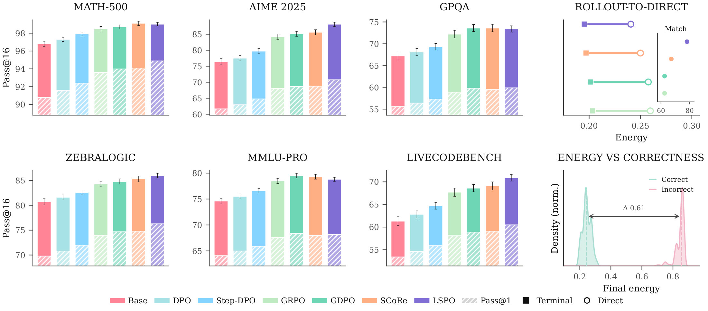
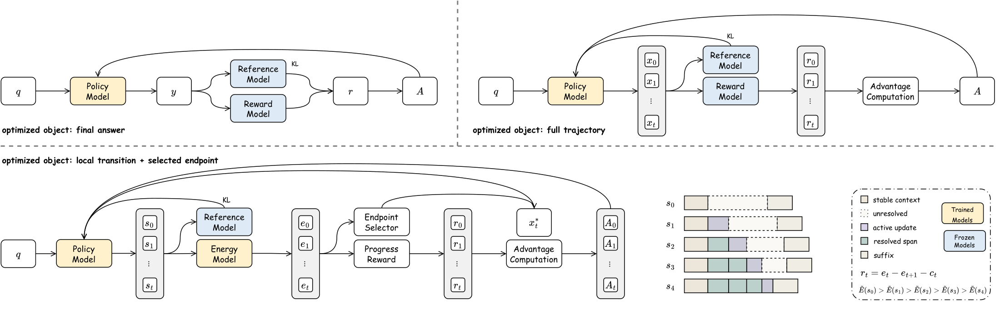
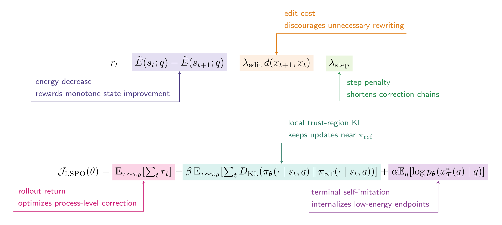
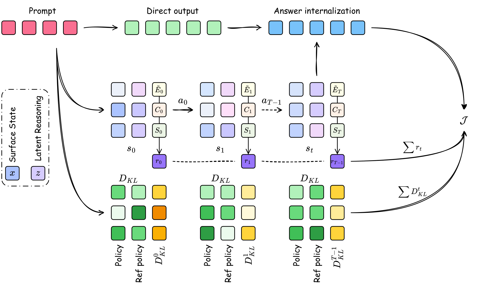
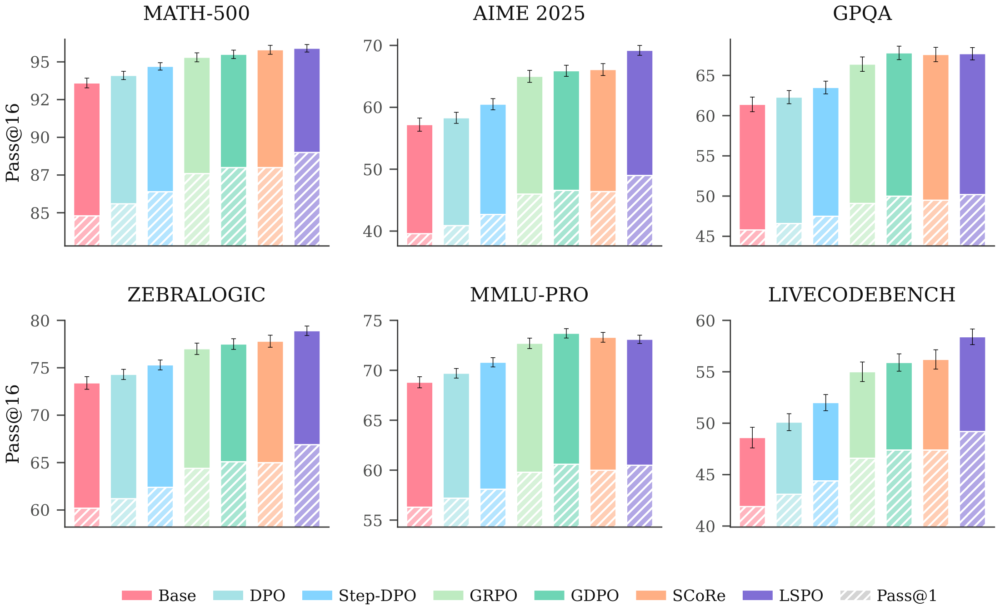
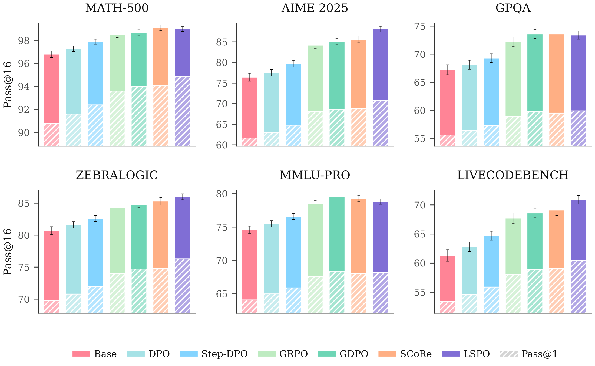
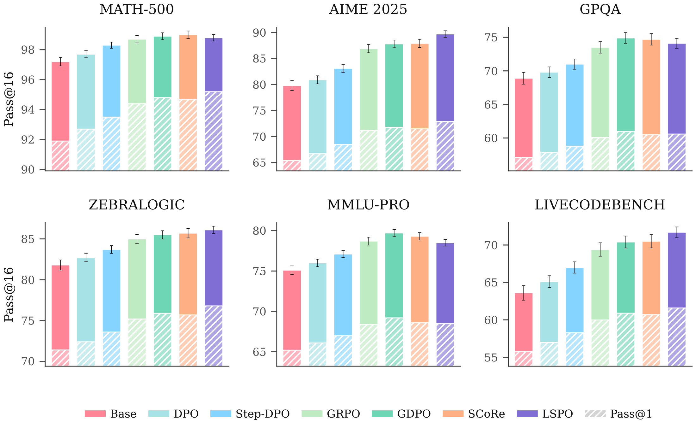
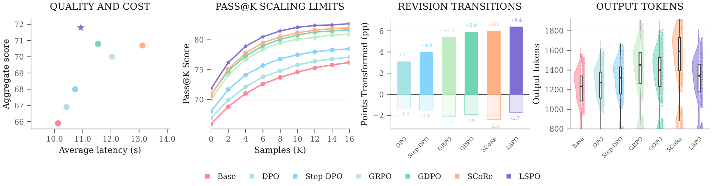
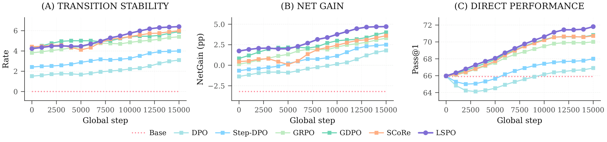
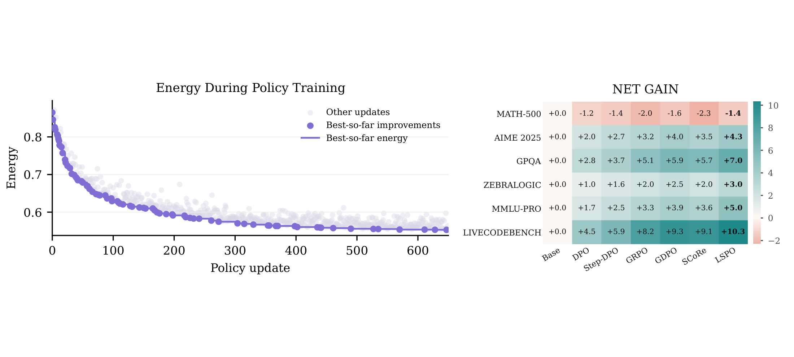

# Self-Correction as Transition Geometry: Internalizing Reasoning via Lifted State Policy Optimization

**NeurIPS 2026** · Ren Zhuang, Ben Wang, Shuifa Sun

Code for **Lifted State Policy Optimization (LSPO)**.

## Overview

LSPO trains language models to internalize answer correction. Each answer is paired with a continuous auxiliary coordinate that carries refinement context. A controller learns local revisions from energy decreases, balanced against edit and step costs. Selected answers then become training targets for the generator. At deployment, the model produces answers through direct generation.



Improvements found during training persist in direct generation. On Qwen3.5-27B, the LSPO policy attains the highest aggregate direct pass@1 and pass@16 accuracy across benchmarks in the left panels, selected training endpoints align closely with deployed outputs in the top right, and final energy separates correct from incorrect answers in the bottom right.

### Method



Comparison of training paradigms. Preference learning in the top left panel optimizes static final answers, while trajectory RL in the top right panel maximizes returns across full rollouts. LSPO in the bottom panel assigns credit to local transitions and internalizes selected endpoints.



Annotated reward and objective for LSPO. The assignment of credit per step, the regularization of the policy, and direct training on the answer occupy distinct terms within the update.

<p align="center">
  
</p>

A single LSPO training update. Move shaping in the lifted space and answer internalization act concurrently on the selected candidate.

### Benchmark Results

The paper evaluates Qwen3.5-9B and Qwen3.5-27B dense models, together with the Qwen3.5-35B-A3B mixture-of-experts model. Each figure reports results across six benchmarks. Hatched bars show pass@1; full bar heights show pass@16.

**Qwen3.5-9B**

<p align="center">
  
</p>

Benchmark profile for Qwen3.5-9B. LSPO improves direct accuracy while preserving substantial sampled pass@16 headroom in the smaller dense backbone.

**Qwen3.5-27B**

<p align="center">
  
</p>

Benchmark profile for Qwen3.5-27B. LSPO achieves consistent direct gains while preserving the sampled pass@16 envelope.

**Qwen3.5-35B-A3B**

<p align="center">
  
</p>

Benchmark profile for Qwen3.5-35B-A3B. LSPO remains the strongest direct policy as available performance headroom narrows in the MoE backbone.

### Quality and Internalization



Quality, sampling, revision, and token cost on Qwen3.5-27B. LSPO reaches 71.8% accuracy at 10.9 s latency in a single pass; test-time reflection adds 0.1 points but costs 4.3 s more and 440 additional tokens. LSPO remains above the pass@$k$ curve, most often converts incorrect answers to correct ones, and avoids the long latency tail of repeated refinement.

### Training Dynamics

<p align="center">
  
</p>

Training dynamics across transition stability, net gain, and direct accuracy. Transition stability and net gain plateau before direct accuracy, consistent with the geometric landscape forming before the generator absorbs it.

<p align="center">
  
</p>

Policy-training energy and task-level net gains. The left panel shows recorded energy across policy updates, where the curve tracks the cumulative minimum and points mark new minima. The right panel independently reports net correction gains across benchmarks.

Component ablations on Qwen3.5-27B. The full LSPO stack leads in aggregate score while controlling latency, output length, and training cost.

| Variant | Agg. | Net gain | Latency (s) | Tokens | GPU hrs |
| --- | ---: | ---: | ---: | ---: | ---: |
| LSPO full | 71.8 | 4.7 | 10.93 | 1265 | 2983 |
| - w/o lifting | 70.9 | 3.2 | 11.70 | 1316 | 2804 |
| - w/o progress reward | 70.0 | 1.6 | 12.35 | 1366 | 2715 |
| - w/o internalization | 70.3 | 2.4 | 12.02 | 1341 | 2566 |
| GRPO | 70.0 | 3.3 | 12.04 | 1370 | 2386 |
| DPO | 66.9 | 1.8 | 10.42 | 1196 | 1218 |

## Initialization

Use Python 3.12 and a CUDA-enabled PyTorch installation. Minimum package versions are listed in [requirements.txt](requirements.txt).

```bash
git clone https://github.com/Venomrko/lspo.git
cd lspo
pip install -r requirements.txt
```

Minimum hardware: **8 × NVIDIA A100 80GB GPUs**, or GPUs with equivalent or greater memory and compute capacity. The paper experiments used 8 × NVIDIA A100 80GB GPUs.

## Data Preparation

Training sources are specified in `data.sources` in [configs/paper.json](configs/paper.json). The loader downloads their training splits through Hugging Face Datasets. Ensure that the datasets and the configured model weights are accessible before training.

Training corpus mixture and sample counts shared by the compared methods.

| Task family | Public corpus source | Samples |
| --- | --- | ---: |
| Math | [open-r1/OpenR1-Math-220k](https://huggingface.co/datasets/open-r1/OpenR1-Math-220k) | 38,000 |
| Code | [BAAI/TACO](https://huggingface.co/datasets/BAAI/TACO) | 24,000 |
| Science | [allenai/sciq](https://huggingface.co/datasets/allenai/sciq) | 18,000 |
| Logic | [longface/logicLM](https://huggingface.co/datasets/longface/logicLM) | 12,000 |

Set the dataset identifiers in `data.sources` and the per-domain budgets in `data.mixture`. The default backbone is [Qwen3.5-27B](https://huggingface.co/Qwen/Qwen3.5-27B), configured through `model.backbone`.

## Training

Train with the default configuration:

```bash
python scripts/train.py --config configs/paper.json --devices 8
```

For a separate seed and output directory:

```bash
python scripts/train.py --config configs/paper.json --devices 8 --seed 1234 --output-dir runs/seed1234
```

Resume a run:

```bash
python scripts/train.py --config configs/paper.json --devices 8 --resume runs/paper_27b/checkpoints/last.ckpt
```

Evaluate the trained checkpoint:

```bash
python scripts/evaluate.py --config configs/paper.json --checkpoint runs/paper_27b/final.ckpt --devices 8 --output evaluation.json
```

## License

This code is released under the [MIT License](LICENSE). Model weights and datasets retain their respective licenses.

## Citation

```bibtex
@inproceedings{zhuang2026lspo,
  title = {Self-Correction as Transition Geometry: Internalizing Reasoning via Lifted State Policy Optimization},
  author = {Zhuang, Ren and Wang, Ben and Sun, Shuifa},
  booktitle = {Advances in Neural Information Processing Systems},
  year = {2026}
}
```
